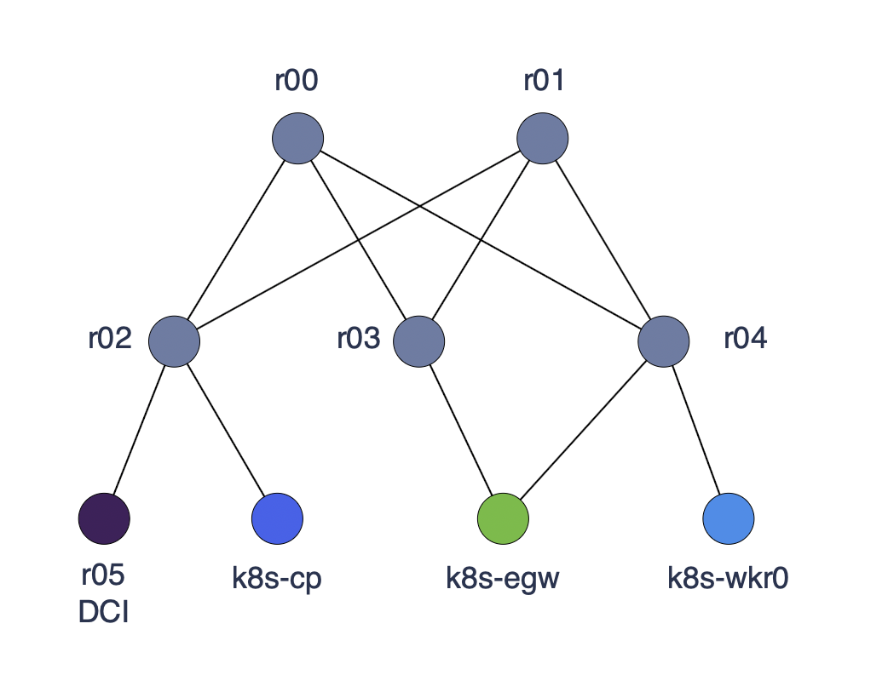

## Cilium Egress Gateway Lab

## Contents

* [Topology](#topology)
  * [cilium-bgpv2 directory](#cilium-bgpv2-directory)
  * [nx-config directory](#nx-config-directory)
  * [vm-config directory](#vm-config-directory)
* [Instructions](#instructions)
  * [Launch VMs and Containerlab Topology](#launch-vms-and-containerlab-topology)
  * [Install Kubernetes](#install-kubernetes)
  * [Deploy Egress Gateway](#deploy-egress-gateway)
  * [Test Egress Gateway](#test-egress-gateway)
* [appendix, notes](#appendix-notes)

### Topology

Containerlab network topology:
- Two Nexus 9000v spine nodes
- Three Nexus 9000v leaf nodes
- One XRd DCI node

Ubuntu 22.04 VMs attached to the containerlab leaf nodes:
- k8s-cp - kubernetes control plane node
- k8s-wkr0 - kubernetes worker node
- k8s-wkr1 - kubernetes worker node
- k8s-egw - kubernetes/cilium egress gateway node



### cilium-bgpv2 directory
- yaml files for deploying Cilium Enterprise CNI, BGP, and Egress Gateway

### nx-config directory

- Nexus 9000v configurations
- Nexus nodes will boot with these configs on containerlab startup

### vm-config directory

- virsh XML files for defining linux bridge networks to interconnect the VMs with containerlab routers
- virsh XML files defining the VMs themselves
- etc/netplan files defining the VMs' network interfaces and routes

## Instructions

### Launch VMs and Containerlab Topology

1. Acquire or construct Ubuntu 22.04 VMs 
2. Define VM networks and nodes, and launch VMs
```
cd vm-config
sudo ./virsh-script.sh
```

3. Launch the containerlab nx9000v topology
```
sudo containerlab deploy -t topology.yaml
```

4. ssh to vms:
```
# k8s-cp
ssh cisco@192.168.122.100

# k8s-egw
ssh cisco@192.168.122.101

# k8s-wkr0
ssh cisco@192.168.122.102
```

5. Ping control plane node from egress gateway node and worker node
```
ping 10.10.10.2
```

### Install Kubernetes

1. Install kubeadm, kubelet, kubectl, and containerd on the VMs [Instructions](xtras/k8s-install.md)

2. Initialize the control plane node
```
cd vm-config
sudo kubeadm init --config=k8s-cp-kubeadm-init.yaml
```

3. Join the egress gateway node and worker node to the cluster
```
# k8s-egw
cd vm-config
sudo kubeadm join --config=k8s-egw-kubeadm-join.yaml

# k8s-wkr0
cd vm-config
sudo kubeadm join --config=k8s-wkr0-kubeadm-join.yaml
```

4. Verify nodes from the control plane node
```
kubectl get nodes -o wide
```

5.  Install Cilium Enterprise on the control plane node
Note: this step requires a license from Isovalent

6. Verify the installation
```
kubectl get pods -A 
```

7. List Helm values
```
helm get values cilium -n kube-system
```

### Deploy Egress Gateway

1.  label the egress gateway node
```
kubectl label node k8s-egw egress-node=green
```

Note: if you need to remove the label:
```
kubectl label node k8s-egw egress-node-
```

2. Apply the egress gateway policy
```
kubectl apply -f 10-egw-policy.yaml
```

3. verify egress policy
```
kubectl edit IsovalentEgressGatewayPolicy egress-green
```

4. Verify Cilium has attached the VIP to the egress gateway node
```
# from k8s-egw
ip addr show ens5
```

Expected output:
```
cisco@k8s-egw:~/cilium-egw/vm-config$ ip addr show ens5
4: ens5: <BROADCAST,MULTICAST,UP,LOWER_UP> mtu 1500 qdisc fq_codel state UP group default qlen 1000
    link/ether 52:54:ab:00:00:03 brd ff:ff:ff:ff:ff:ff
    altname enp0s5
    inet 10.10.21.2/24 brd 10.10.21.255 scope global ens5
       valid_lft forever preferred_lft forever
    inet 192.150.9.124/32 scope global ens5
       valid_lft forever preferred_lft forever
    inet6 fe80::5054:abff:fe00:3/64 scope link 
       valid_lft forever preferred_lft forever
```

5. apply bgp cluster config
```
kubectl apply -f 20-bgp-cluster.yaml
```

6. Annotate the egress gateway node to force bgp router id
```
kubectl annotate node k8s-egw cilium.io/bgp-virtual-router.65010="router-id=10.10.21.2"
```

7. apply bgp peer config
```
kubectl apply -f 30-bgp-peer.yaml
```

8. apply bgp advertisement config
```
kubectl apply -f 40-bgp-advert.yaml
```

9. check bgp peers
```
cilium bgp peers
cilium bgp peers --node k8s-egw
cilium bgp routes
```

Expected output:
```
cisco@k8s-cp:~/cilium-egw/cilium-bgpv2$ cilium bgp peers
Node      Local AS   Peer AS   Peer Address   Session State   Uptime   Family         Received   Advertised
k8s-egw   65010      65005     10.0.0.5       established     8s       ipv4/unicast   1          1    
cisco@k8s-cp:~/cilium-egw/cilium-bgpv2$ cilium bgp routes
(Defaulting to `available ipv4 unicast` routes, please see help for more options)

Node      VRouter   Prefix             NextHop   Age   Attrs
k8s-egw   65010     192.150.9.124/32   0.0.0.0   22s   [{Origin: i} {Nexthop: 0.0.0.0}]   
cisco@k8s-cp:~/cilium-egw/cilium-bgpv2$ cilium bgp routes available
(Defaulting to `ipv4 unicast` AFI & SAFI, please see help for more options)

Node      VRouter   Prefix             NextHop   Age   Attrs
k8s-egw   65010     192.150.9.124/32   0.0.0.0   30s   [{Origin: i} {Nexthop: 0.0.0.0}]   
cisco@k8s-cp:~/cilium-egw/cilium-bgpv2$ 
```

10. deploy test pods and namespaces
```
kubectl apply -f 50-ns-pods.yaml
```

11. verify pods
```
kubectl get pods -A
```

### Test Egress Gateway

1. exec into one of the blue pods
```
kubectl exec -it -n blue bluepod0 -- /bin/sh
```

2. ping the DCI node
```
ping 10.0.0.5 -i .3
```

Expected output:
```
/ # ping 10.0.0.5 -i .3
PING 10.0.0.5 (10.0.0.5): 56 data bytes
64 bytes from 10.0.0.5: seq=0 ttl=253 time=22.028 ms
64 bytes from 10.0.0.5: seq=1 ttl=253 time=18.840 ms
64 bytes from 10.0.0.5: seq=2 ttl=253 time=17.367 ms
```

3. Validate the egress gateway is NAT'ing outbound traffic
   Keep the ping running then start a tcpdump on your Topology Host
```
sudo tcpdump -ni k8s-egw-net2
```

Expected tcpdump output:
```
cisco@topology-host:~$ sudo tcpdump -ni k8s-egw-net2
[sudo] password for cisco: 
tcpdump: verbose output suppressed, use -v[v]... for full protocol decode
listening on k8s-egw-net2, link-type EN10MB (Ethernet), snapshot length 262144 bytes
20:53:36.222803 IP 192.150.9.124 > 10.0.0.5: ICMP echo request, id 36691, seq 0, length 64
20:53:36.234431 IP 10.0.0.5 > 192.150.9.124: ICMP echo reply, id 36691, seq 0, length 64
20:53:36.523434 IP 192.150.9.124 > 10.0.0.5: ICMP echo request, id 36691, seq 1, length 64
20:53:36.531602 IP 10.0.0.5 > 192.150.9.124: ICMP echo reply, id 36691, seq 1, length 64
```


## appendix, notes


1. add host route on worker EGW node
```
sudo ip route add 192.150.9.124/32 dev ens4
```

### uninstall
```
helm uninstall cilium -n kube-system
```

```
helm upgrade cilium isovalent/cilium --namespace kube-system    --reuse-values    --set egressGateway.enabled=true --set egressGateway.installRoutes=true   --set bpf.masquerade=true    --set kubeProxyReplacement=true
```

## List all CRDs related to Isovalent
```
kubectl get crd | grep isovalent
```

# Get detailed information about the IsovalentBGPAdvertisement CRD
```
kubectl get crd isovalentbgpadvertisements.isovalent.com -o yaml
```

# Get detailed information about the IsovalentEgressGatewayPolicy CRD
```
kubectl get crd isovalentegressgatewaypolicies.isovalent.com -o yaml
```


# Get the schema in a more readable format
```
kubectl explain isovalentbgpadvertisement.spec
kubectl explain isovalentbgpadvertisement.spec.advertisements
```

# Get the schema in a more readable format
```
kubectl explain isovalentegressgatewaypolicy.spec
kubectl explain isovalentegressgatewaypolicy.spec.selectors
```

```
kubectl get isovalentegressgatewaypolicies -o yaml
```